# Lab17-Create an API 

This project is more practice in creating a RESTful API within the .NET Framework Core MVC application. 

This API consists of two controllers, a ToDo task and a ToDoList. Each is a separate table on a SQL database and is deployed through Azure. Full CRUD operations are available for both of these and you can add a ToDo task to a ToDoList and if a ToDoList is removed before tasks are removed from that list, it will delete all the ToDo tasks as well. 

***
### Getting Started:
Visit the api [here](http://eisj-todoapi.azurewebsites.net/api/todo) to see a working version. If that is no longer available, follow these steps to deploy it locally

* Download the latest .NET SDK
* Navigate and dowload the project files
* When you open, you'll want to make sure that you create a local database for CRUD to work properly. In the PM console, use `Update-Database` as it will take the existing migrations with the project and create a new setup for you
  * (note: sometimes it will say install EF core and sometimes it does it for you)
* There is a SeedData class to help fill in some entries for your newly created database
* After that is completed, run the application. If you see the bottom images then success! You can now run full CRUD operations on this API. It is recommended that you use the application [Postman](https://www.getpostman.com/apps) to utilize the POST and PUT methods as it is easier to input data.
***
### Visuals (taken from deployed site/postman app)
* GET: api/todo
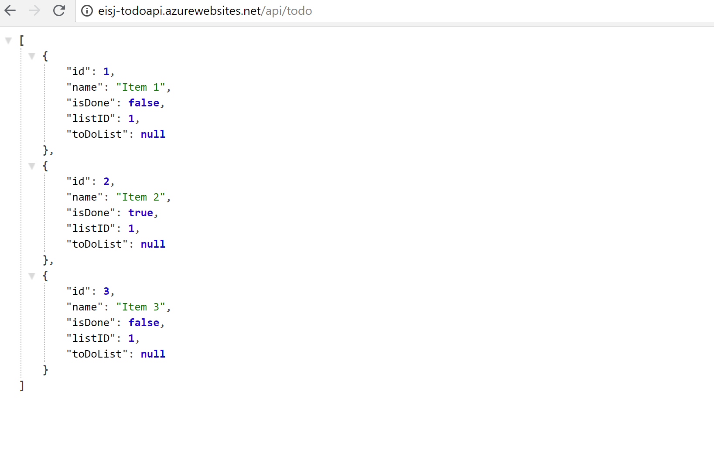
* GET: api/todolist
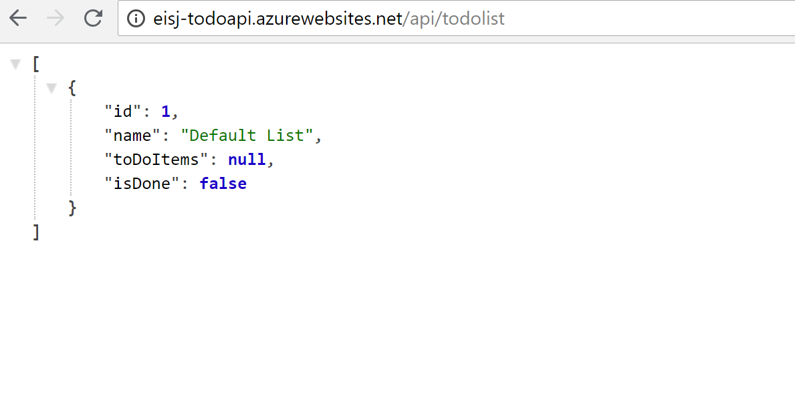
* GET: api/todo/:id
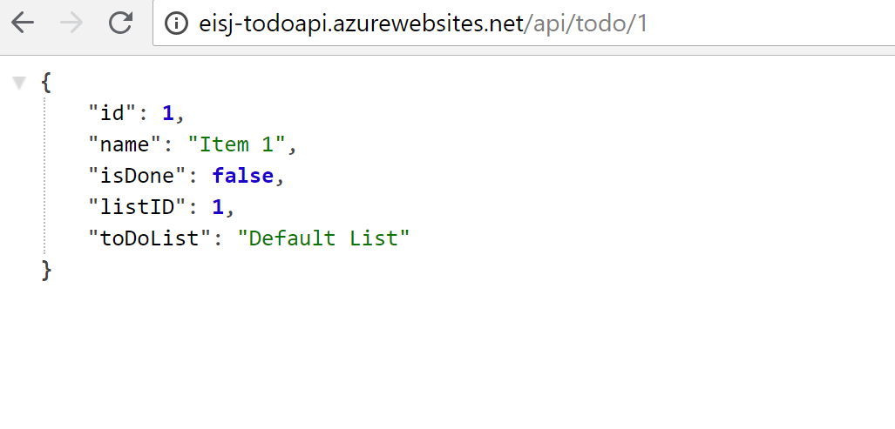
* GET: api/todolist/:
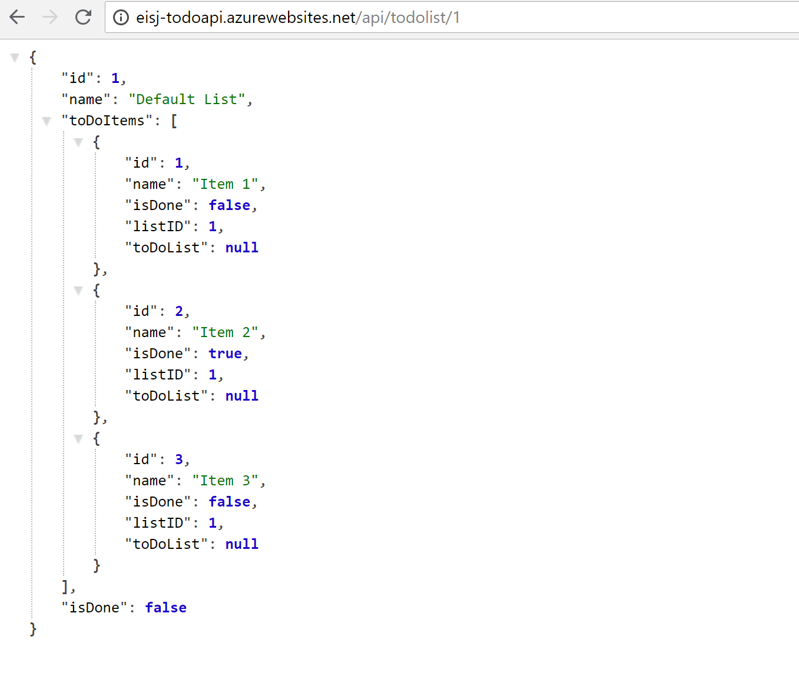
#### Using Postman Application
* POST: api/todo
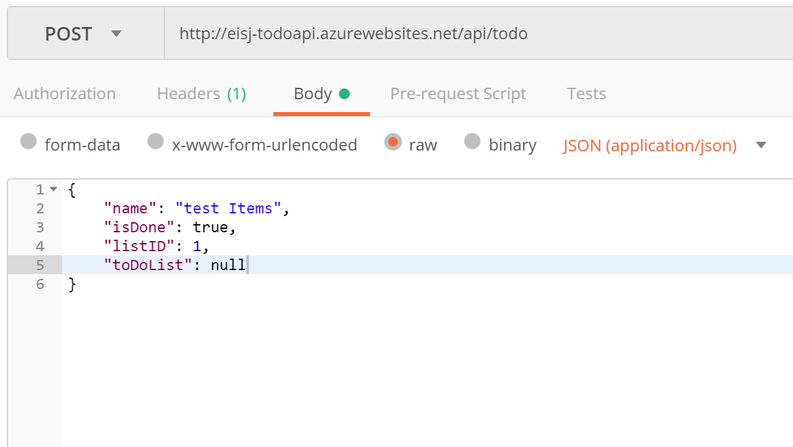
* POST: api/todolist
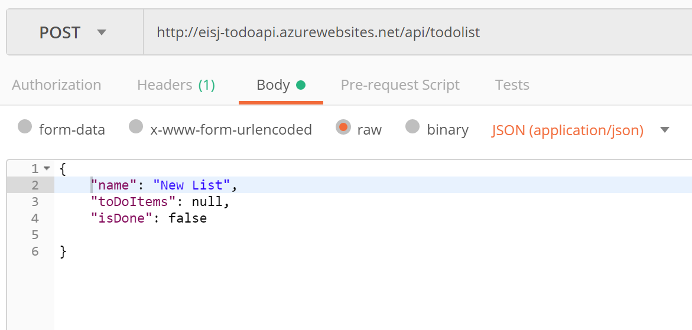
* PUT: api/todo/:id
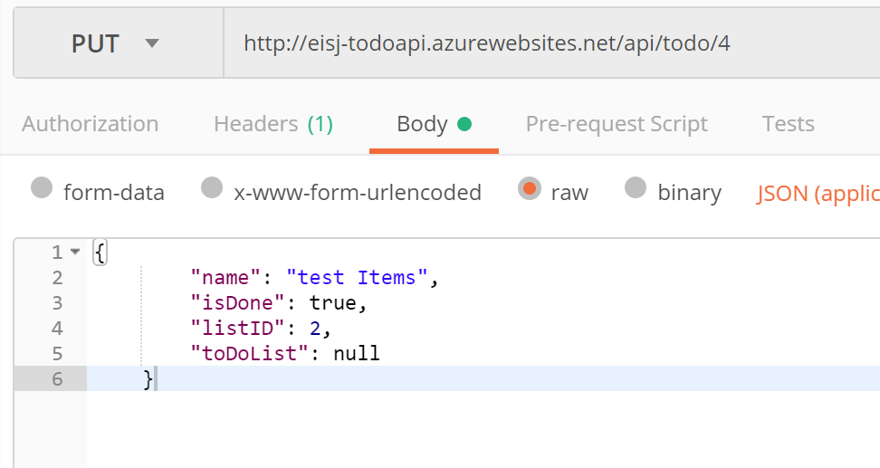
* PUT: api/todolist/Id
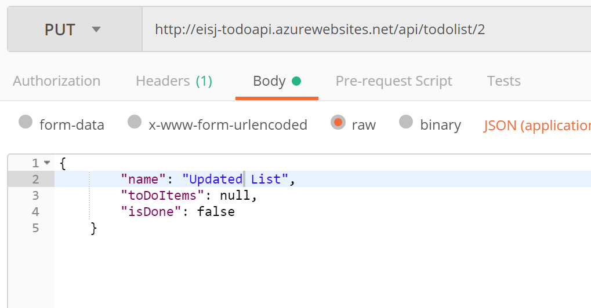
* DELETE: api/todo/:id
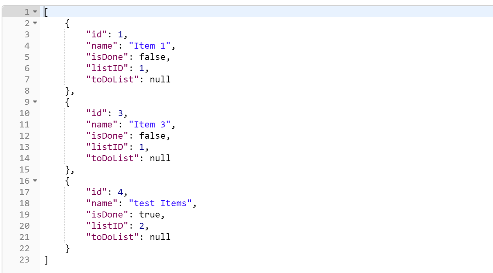
* DELETE: api/todolist/:id
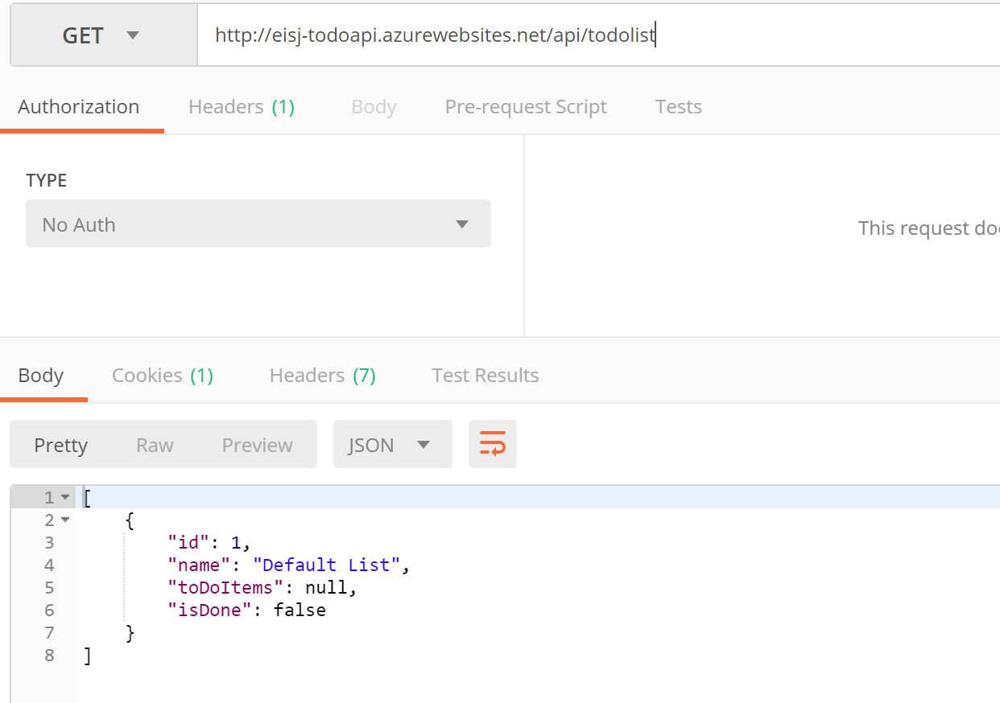
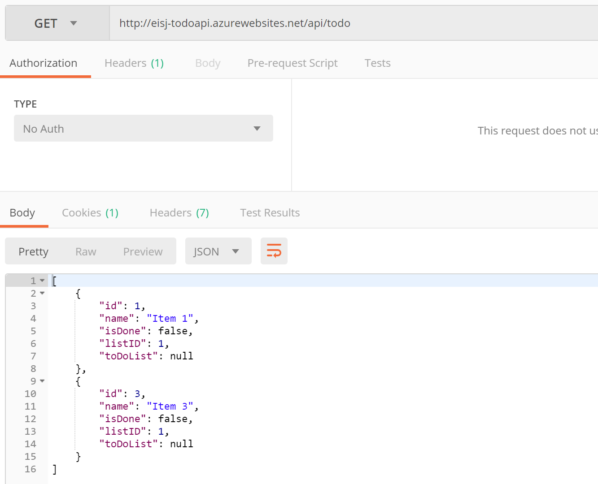
***